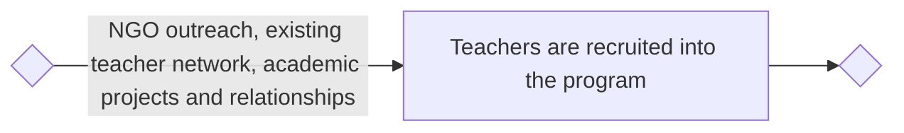
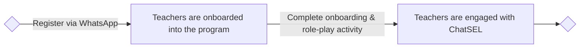
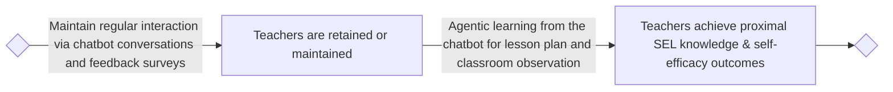
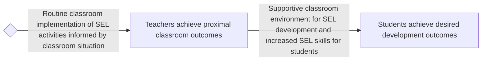

# User Funnel

Here we provide a step-by-step framework that illustrates the journey of teachers from the initial point of awareness about ChatSEL to the final impact on student outcomes. It helps track user behaviors, identify drop-off points, and optimize engagement strategies. For ChatSEL, which operates in low-resource settings, the funnel ensures teachers are effectively onboarded, engaged, and supported to achieve meaningful classroom outcomes.

## A flowchart of the user funnel

## A detailed look at the processes and metrics of the user funnel

| **User Stage** | **We do this Activity to reach this Stage** | **Users must do this Activity to reach this Stage** | **Target Metric to reach this Stage** |
|:---|:---|:---|:---|
| **1. Teachers are recruited into the program** | Partner with NGOs, educational institutions, and local community leaders. Promote ChatSEL through WhatsApp groups, workshops, teacher networks, and referral campaigns. | Register interest by signing up via a WhatsApp link or responding to an outreach message. | Number of teachers registered; response rate to outreach messages. |
| **2. Teachers are onboarded into the program** | Send automated onboarding messages, including a welcome introduction, how-to guide, and SEL overview. Provide an interactive demo session. | Complete onboarding by following instructions, practicing one role-play activity, and confirming readiness. | % of registered teachers who complete onboarding; completion rate of the demo activity. |
| **3. Teachers are engaged (actively interacting with the chatbot)** | Provide daily/weekly SEL content, interactive activities, role-play sessions, and personalized recommendations. Send reminders and motivational messages. | Respond to prompts, complete suggested activities, and provide feedback. | Weekly Active Users (WAU); number of activities accessed per week; engagement rate (interactions per session). |
| **4. Teachers are retained or maintained** | Introduce gamification (badges, certificates), ongoing learning modules, peer support groups, and regular check-ins. Offer new content to sustain interest. | Maintain regular interaction with ChatSEL, participate in feedback surveys, and engage with new content. | Retention rate at 1, 3, and 6 months; frequency of interactions over time; dropout rate reduction. |
| **5. Teachers achieve proximal SEL knowledge and self-efficacy outcomes** | Deliver targeted SEL modules with reflective exercises, practice opportunities, and feedback loops. Emphasize growth mindset and self-efficacy strategies. | Apply SEL strategies in practice sessions, reflect on learning, and self-assess growth. | % of teachers reporting improved SEL understanding and self-efficacy; readiness ratings; growth mindset assessment. |
| **6. Teachers achieve proximal classroom outcomes** | Guide teachers to plan and implement SEL activities in the classroom. Provide adaptive recommendations based on student needs. | Conduct SEL activities with students, adjust based on classroom dynamics, and report outcomes back to ChatSEL. | % of teachers implementing SEL activities regularly; improvements in classroom climate; self- and observer-reported classroom performance. |
| **7. Students achieve desired development outcomes** | Support teachers with continuous feedback and advanced SEL strategies. Provide specific guidance for addressing student needs. | Participate in SEL activities, show engagement in class, and demonstrate SEL skills in practice. | Improvement in students’ SEL competencies (emotion regulation, empathy, social skills); academic outcomes (literacy, numeracy); classroom engagement metrics. |